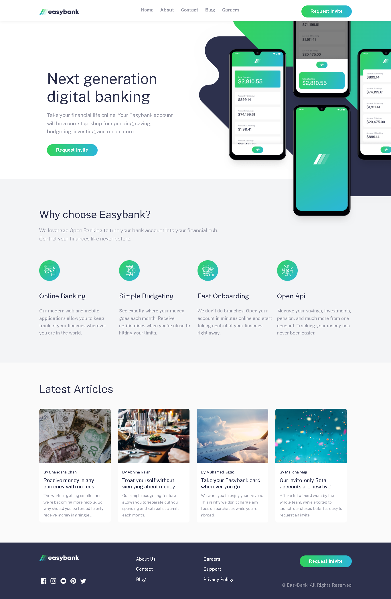
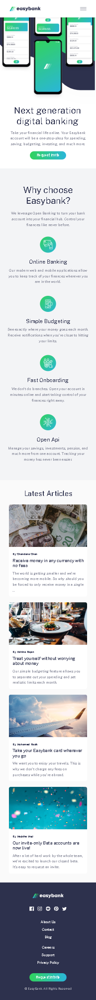

🌐 Easybank – Responsive Landing Page Project

Easybank is a fully responsive, scroll-based landing page created as part of my web development learning journey. Originally built in February 2025 as a simple static site, I redesigned it in June 2025 to reflect modern frontend practices and mobile-first design principles.

The goal of the project was to replicate a clean and structured layout based on a real-world design challenge from Frontend Mentor, with attention to responsive grids, typography, and section-based content flow.

📅 Project Timeline

Initial Version: February 2025
Redesigned: June 24, 2025
Design Source: Frontend Mentor – Easybank Challenge

📖 Project Overview

The original version was a basic static webpage using plain HTML and CSS. After several months of building my skills, I revisited the project to improve its layout structure, visual hierarchy, and responsiveness across screen sizes.

This updated version focuses on clean, accessible code and section-based navigation, making it a great exercise in layout precision and semantic design.

✅ Key Features

Fully responsive layout for desktop, tablet, and mobile

Clean and modern visual hierarchy

Scroll-based multi-section page layout

Structured using semantic HTML and reusable components

Styled using CSS custom properties, Flexbox, and Grid

Based on a professional design specification

🛠️ Built With

HTML5

CSS3 (Flexbox, Grid, Custom Properties, Scroll-Snap)

Vanilla JavaScript (used minimally for structure)

🧠 Key Concepts Practiced

Mobile-first, responsive design techniques

Structuring multi-section layouts with semantic HTML

Designing consistent spacing and typography systems

Implementing scroll-based layout transitions using CSS

Clean, maintainable frontend architecture

📸 Screenshots:

  

🔗 Project Links

🌐 Live Website: [https://mohammedshanid8428.github.io/EasyBank/]

📂 GitHub Repository: [https://github.com/mohammedShanid8428/EasyBank]

👨‍💻 Author: Mohammed Shanid.T
Created & Redesigned in 2025
Inspired by The Odin Project and Frontend Mentor